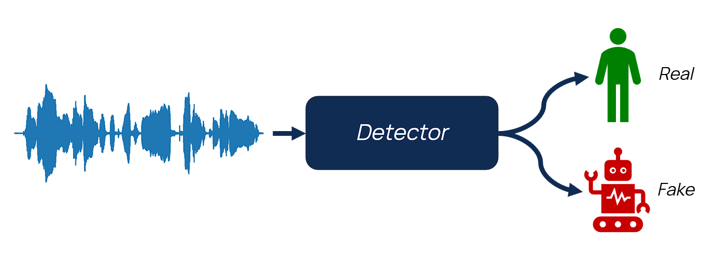
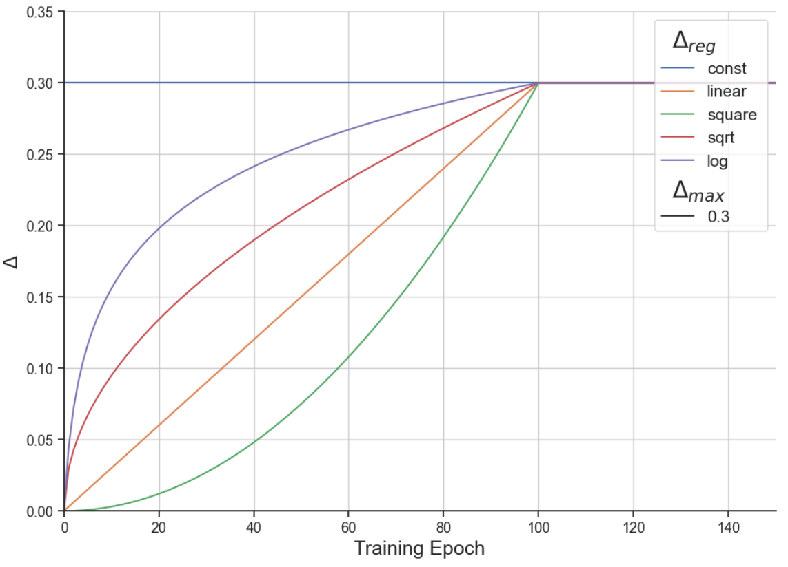
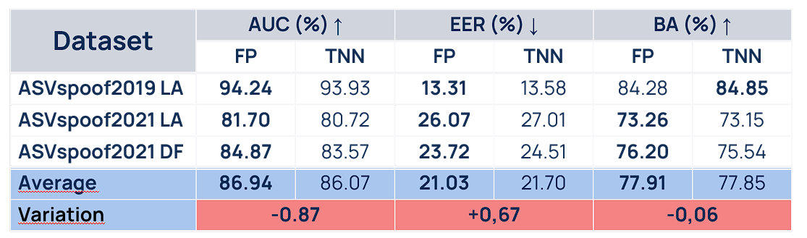
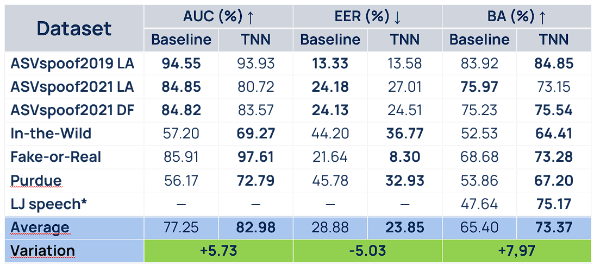
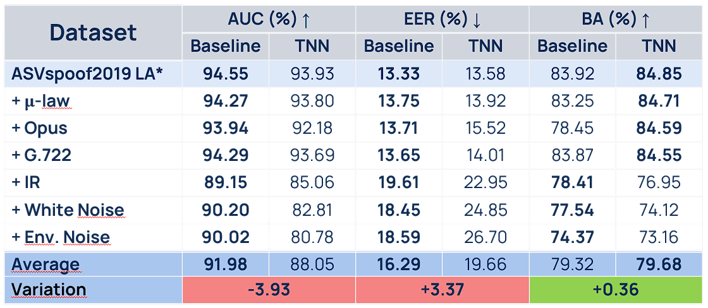

# Lightweight-On-device-Anti-Spoofing-Detection-using-Ternary-Neural-Networks
The purpose of this project was to design a speech deepfake detector using ternary neural networks (TNN) in order to make it deployable in edge computing scenarios.

  

## Model and Ternary Quantization
In order to achieve our goal a Light CNN (LCNN) - an already well-established architecture for anti-spoofing detection in Automatic Speaker Verification systems - was trained on the ASVSpoof2019 LA dataset, quantizing all the its weights and biases to three values: 0, +1 and -1.
This causes any operation involving these parameters to either be a pass-through (+1 multiplications) or a flip-sign (-1 multiplications), or to have no contribution to the final result at all (0 multiplication) and can therefore be skipped.

$$
\begin{equation}
    \mathcal{T}(\theta) =
    \begin{cases}
        +1 & \text{if } \theta > \Delta \\
        0 & \text{if } |\theta| \leq \Delta \\
        -1 & \text{if } \theta < -\Delta
    \end{cases}
\end{equation}
$$

Following [1], the threshold $\Delta$ to which the parameters are quantized evolves during training, starting form an initial value and increasing until a maximum, after which it becomes constant. Five possible regime choices were explored: Constant, Square, Linear, Square root and Log.

  

The Straight-through-Estimator (STE) technique was employed in order to perform quantization during training.

After several attempts, the best model obtained a 98.92% sparsity rate (the ratio between the zeroed weights and the total number of weights) with the following parameters:
- Window: 4 seconds;
- fs: 8000 Hz;
- trim: True;
- lr: 0.001;
- min_lr: 0.0001;
- delta_regime_type: 'sqrt'
- delta_regime_min: 0;
- delta_regime_max: 0.7;
- delta_regime_max_epoch: 50.

## Results - TNN vs Full precision model

Since we applied quantization, we expected a performance loss. In order to measure it, the models were tested on three different datasets: ASVSpoof2019 LA (eval partition), ASVSpoof2021 LA and ASVSpoof2021 DF.
Here are the results:

  

The performance drop never exceed 1%, a degradation that we consider acceptable since we achieve a sparsity rate of 98.92%.

## Results - TNN vs State-of-art lightweight model

To show the benefits of the TNN, we compared it against RawTFNet-16 [2], a model specifically designed to maintain state-of-art performance with very few parameters.
We tested their generalization abilities with seven different datasets (ASVSpoof2019 LA, ASVSpoof2021 LA, ASVSpoof2021 DF, In-the-Wild, Fake-or-Real, Purdue and LJ speech) and their robustness by individually applying six different perturbation to the ASVSpoof2019 dataset.
Moreover, we also estimated their computational costs by computing MACs and their parameter's file size (the TNN model was stored in a COO sparse format to leverage the obtained sparsity rate, but all the parameters were stored in a 32-bit format, instead of a 1-bit format, since Pytorch doesn't support formats with less than 4 bits per parameter).

Generalization results:

  

Robustness results:

  

Computational costs comparison:

  

Parameter's file size comparison:

  

# Bibliography
[1] Giacomo Agnetti, Andrea Migliorati, Daniele Mari, Tiziano Bianchi, Simone Milani, and Enrico Magli. 
        Ternary neural networks for gait identification in wearable devices.
        In 2024 IEEE International Workshop on Information Forensics and Security (WIFS), pages 1–6. IEEE, 2024.

[2] Y. Xiao, T. Dang, and R. K. Das. 
       Rawtfnet: A lightweight cnn architecture for speech anti-spoofing. 
       arXiv e-prints, pages arXiv–2507, 2025.